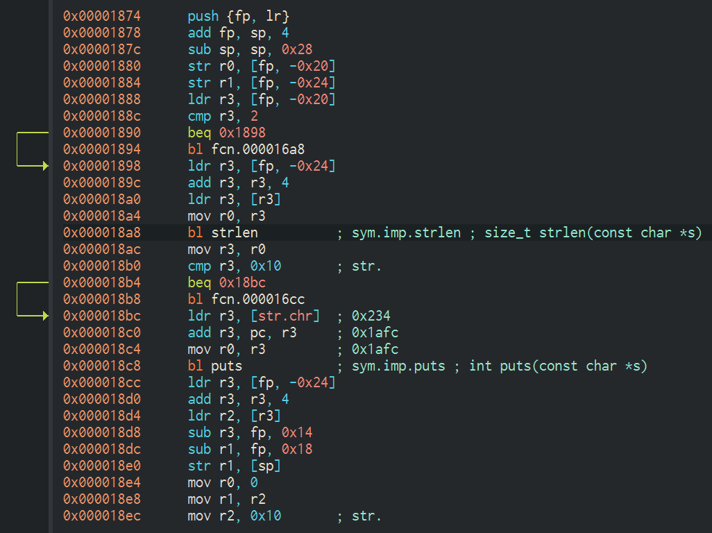

# Tampering and Reverse Engineering on Android

L'apertura di Android lo rende un ambiente favorevole al reverse engineering.
In questo capitolo, analizzeremo alcune peculiarità dei tool di reversing in Android e dei tool specifici del SO.

Android offre ai reverse engineer grandi vantaggi che non sono disponibili in iOS.
Dato che Android è open source, puoi studiare il suo codice sorgente dall'Android Open Source Project (AOSP) e modificare il SO e i suoi tool standard in qualsiasi modo tu voglia.
Anche sui dispositivi standard è possibile attivare la developer mode e caricare app senza fare tanti salti mortali.
Dall'insieme di tool offerti dall'SDK all'ampia gamma di tool di reverse engineering, ci sono diversi trucchi che possono facilitarti il lavoro.

Tuttavia, ci sono anche alcune sfide Android.
Per esempio, dovrai avere a che fare sia con il Java byte-code che con il codice nativo.
La Java Native Interface (JNI) a volte è usata per confondere i reverse engineer (ci sono ragioni legittime per usare JNI, come il miglioramento delle performance o il supporto di codice legacy).
A volte gli sviluppatori usano il layer nativo per "nascondere" i dati e le funzionalità, e potrebbero strutturare le loro app in modo che l'esecuzione salti frequentemente tra i due layer.

Avrai bisogno di almeno una conoscenza base dell'ambiente Android basato su Java e del SO e kernel Linux, su cui Android è basato.
Avrai bisogno anche dei tool giusti per gestire il bytecode in esecuzione su una JVM e il codice nativo.

Useremo gli OWASP Mobile Security Testing Guide Crackmes come esempi per dimostrare diverse tecniche di reverse engineering nelle sezioni successive, quindi aspettati spoiler parziali o totali.
Ti raccomandiamo di provarci prima da solo e poi continuare a leggere.

### Reverse Engineering

Il reverse engineering consiste nello smontare un'app e capire come funziona.
Puoi farlo 
esaminando l'app compilata (analisi statica), 
osservando l'app a run time (analisi dinamica), o 
entrambe.

### Tooling

Assicurati che i seguenti tool siano installati sul tuo sistema (vedi il capitolo "Android Basic Security Testing" per l'installazione):

- gli ultimi tool SDK e platform-tool SDK.
Questi pacchetti includono il client Android Debug Bridge (ADB) e altri tool che si interfacciano con la piattaforma Android
- l'Android NDK.
La Native Development Kit contiene toolchain precompilate per cross-compile di codice nativo per diverse architetture.
Ne avrai bisogno se pensi di dover trattare codice nativo, es. per ispezionarlo o per debug (la NDK contiene versioni precompilate utili come gdbserver o strace per diverse architetture)

Inoltre, avrai bisogno di qualcosa per rendere il Java bytecode più human-readable.
Fortunatamente, i decompiler Java gestiscono bene il bytecode Android.
JD, JAD, Procyon e CFR sono famosi decompiler gratuiti.
Puoi usare lo script [apkx](https://github.com/b-mueller/apkx) che incrorpora alcuni di questi decompiler.
Questo script automatizza completamente il processo di estrazione del codice Java dai file APK.

Altri tool sono scelti in base a preferenze e budget.
Esistono molti disassembler, decompiler e framework gratuiti e commerciali con punti di forza e di debolezza diversi.
Li vedremo in questo capitolo.

#### Building a Reverse Engineering Environment for Free

Con un piccolo sforzo, puoi creare gratuitamente un buon ambiente di reverse engineering GUI-based.

Per la navigazione dei sorgenti decompilati, raccomandiamo IntelliJ, un IDE relativamente leggero e ottimo per la navigazione del codice.
Consente debugging su device di base per app decompilate.
Tuttavia, se preferisci qualcosa che sia goffo, lento e complicato da usare, Eclipse è l'IDE giusto per te (secondo il pregiudizio personale dell'autore).

Se non ti cambia analizzare Smali invece che Java, puoi usare il plugin di IntelliJ `smalidea` per il debugging.
Smalidea supporta il single-stepping attraverso il bytecode e il renaming degli identificatori, e monitora i registri senza nome, che lo rendono più potente del setup JD + IntelliJ.

apktool è un tool gratuito famoso che può estrarre e disassemblare risorse direttamente dall'APK e disassemblare bytecode Java nel formato Smali 
(Smali/Backsmali è un assembler/disassembler per il formato Dex. 
In islandese è Assembler/Disassembler).
apktool ti permette di riassemblare il package, che risulta utile per il patching e per l'applicazione di modifiche all'Android Manifest.

Puoi svolgere compiti più complessi (come l'analisi del programma e il deoffuscamento automatico) con framework di reverse engineering gratuiti come Radare2 e Angr.
Troverai diversi esempi per molti di questi tool e framework gratuiti in questa guida.

#### Commercial Tools

È possibile preparare gratuitamente un ambiente di reverse engineering.
Tuttavia, esistono delle alternative commerciali.
Quelle maggiormente usate sono:

- JEB,
un decompiler commerciale,
impacchetta tutte le funzionalità necessarie all'analisi statica e dinamica delle app Android in un solo package.
È ragionevolmente affidabile e include un supporto per il prompt.
Ha un debugger built-in, che consente l'inserimento di breakpoint direttamente nei sorgenti decompilati (e annotati), specialmente nel codice offuscato con Proguard.
Ovviamente, questa comodità non è gratis, e ora che JEB ha una licenza subscription-based, richiede un canone mensile
- IDA Pro nella sua versione a pagamento è compatibile con ARM, MIPS, bytecode Java, e, ovviamente, binari ELF.
Ha un debugger sia per applicazioni Java che per processi nativi.
Con i suoi potenti script, disassembler ed estensioni, IDA Pro funziona benissimo per l'analisi statica di programmi nativi e librerie.
Tuttavia, le capacità di analisi statica offerte per Java sono molto base: ottieni l'assembly Smali ma niente di più.
Non puoi navigare nel package e nella struttura delle classi, e alcune azioni (come il renaming delle classi) non possono essere eseguite, che per alcune app più complesse è strettamente necessario.
Inoltre, a meno che tu non possa avere la versione a pagamento, non sarà d'aiuto durante il reverse engineering di codice nativo dato che la versione freeware non supporta i processori ARM

### Disassembling and Decompiling

Nel security testing di app Android, se l'app è basata solo su Java e non ha alcun codice nativo (codice C/C++), il processo di reverse engineering è relativamente facile ed è in grado di decompilare quasi tutto il codice sorgente.
In questi casi, il black-box testing (con l'accesso al binario compilato, ma non al codice sorgente originale) può essere molto vicino al white-box testing.

Tuttavia, se il codice è stato appositamente offuscato (o sono stati usati tool di anti decompilazione), il processo di reverse engineering potrebbe essere molto dispendioso e improduttivo.
Ciò riguarda anche le applicazioni che contengono codice nativo.
Si può applicare il reverse engineering, ma il processo non è automatizzato e richiede la conoscenza di dettagli di basso livello.

#### Decompiling Java Code

Il processo di decompilazione consiste nel convertire il bytecode Java in codice sorgente Java.
Useremo l'app UnCrackable Level 1 per Android nei seguenti esempi.

```sh
$ wget https://github.com/OWASP/owasp-mstg/raw/master/Crackmes/Android/Level_01/UnCrackable-Level1.apk

$ adb install UnCrackable-Level1.apk
```

Usando l'app vediamo che richiede un secret.
Lo cerchiamo nell'apk estraendone i file.

```sh
$ unzip UnCrackable-Level1.apk -d UnCrackable-Level1
```

Nel setup standard, tutto il bytecode Java e i dati dell'app sono nel file `classes.dex` nella root directory dell'app.
Questo file è conforme al Dalvik Executable Format (DEX), una specifica Android per il packaging di programmi Java.
Molti decompiler Java usano le classi o i JAR come input, quindi devi prima convertire il file classes.dex in un file JAR.
Puoi usare `dex2jar` o `enjarify`.

Quando hai il file JAR, puoi usare un qualsiasi decompiler per recuperare il codice Java.
In questo esempio useremo il decompiler CFR.
CFR è in sviluppo attivo, e sono disponibili nuove release sul suo sito.
CFR è rilasciato sotto licenza MIT, quindi puoi usarlo liberamente anche se il suo codice sorgente non è disponibile.

Il modo più semplice per eseguire CFR è attraverso `apkx`, che include anche `dex2jar` e automatizza l'estrazione, la conversione e la decompilazione.

```sh
$ git clone https://github.com/b-mueller/apkx
$ cd apkx
$ sudo ./install.sh
```

Dovrebbe copiare `apkx` in `/usr/local/bin`.
Eseguilo passando `UnCrackable-Level1.apk`.

```sh
$ apkx UnCrackable-Level1.apk
Extracting UnCrackable-Level1.apk to UnCrackable-Level1
Converting: classes.dex -> classes.jar (dex2jar)
dex2jar UnCrackable-Level1/classes.dex -> UnCrackable-Level1/classes.jar
Decompiling to UnCrackable-Level1/src (cfr)
```

Dovresti trovare i sorgenti decompilati nella directory `UnCrackable-Level1/src`.
Per vedere i sorgenti, un semplice text editor (preferibilimente con syntax highlight) è accettabile, ma il caricamento del codice in un IDE Java rende la navigazione più facile.
Importiamo il codice in IntelliJ, che fornisce anche una funzionalità di debugging su device.

Apri IntelliJ e scegli "Android" come tipo di progetto nel tab di sinistra nel dialog "New Project".
Inserisci "Uncrackable1" come nome dell'app e "vantagepoint.sg" come company name.
Risulta la creazione del package "sg.vantagepoint.uncrakable1", che corrisponde al nome originale del package.
L'uso di un nome uguale è importante se vuoi agganciare il debugger all'app in esecuzione dato che IntelliJ usa il package name per identificare il processo corretto.

Nel dialog successivo, scegli un qualsiasi API number, non compilerai realmente il progetto, quindi il numero non conta.
Scegli "next" e "Add no Activity", poi clicca su "finish".

Una volta creato il progetto, espandi la vista "1: Project" sulla sinistra e naviga nel folder `app/src/main/java`.
Tasto destro ed elimina il package di default `sg.vantagepoint.uncrackable1` creato da IntelliJ.

Ora, apri la directory `Uncrackable-Level1/src` in un file browser e copia le directory `sg` nel folder `java` ora vuoto nella vista del progetto IntelliJ.

Otterrai una struttura che somiglia al progetto Android Studio a partire dal quale l'app è stata creata.

Guarda la sezione "Reviewing Decompiled Java Code" qui sotto per imparare a ispezionare il codice Java decompilato.

#### Disassembling Native Code

Sia Dalvik che ART supportano la JNI, che definisce il modo con cui il codice Java interagisce con il codice nativo scritto in C/C++.
Come in altri SO Linux-based, il codice nativo viene impacchettato (compilato) in librerie dinamiche ELF (.so), che l'app Android carica a run time tramite il metodo `System.loadLibrary`.
Tuttavia, invece di basarsi su librerie C diffuse (come glibc), i binari Android sono compilati rispetto a una libc custom chiamata Bionic.
Bionic aggiunge un supporto per servizi specifici di Android come system properties e logging, e non è completamente compatibile con POSIX.

Quando fai il reversing di app Android contenenti codice nativo dovrai considerare questo particolare layer tra Java e la JNI.
Vale la pena notare che quando si fa il reversing si ha bisogno di un disassembler.
Una volta che il binario sarà caricato, analizzerai il disassembly, che non è così facile da ispezionare come il codice Java.

Nell'esempio seguente faremo il reversing di HelloWorld-JNI.apk dal repository MSTG di OWASP.
L'installazione e l'esecuzione su emaulatore o device Android è opzionale.

```sh
wget https://github.com/OWASP/owasp-mstg/raw/master/Samples/Android/01_HelloWorld-JNI/HelloWord-JNI.apk
```

Quest'app non è un gran chè, tutto ciò che fa è mostrare una label con testo "Hello from C++".
Questa è l'app Android generata di default quando si crea un nuovo progetto con il supporto C/C++.
É sufficiente a mostrare i principi base delle chiamate JNI.

Decompila l'apk usando `apkx`.

```sh
$ apkx HelloWord-JNI.apk
Extracting HelloWord-JNI.apk to HelloWord-JNI
Converting: classes.dex -> classes.jar (dex2jar)
dex2jar HelloWord-JNI/classes.dex -> HelloWord-JNI/classes.jar
Decompiling to HelloWord-JNI/src (cfr)
```

Il codice viene estratto nella directory `HelloWorld-JNI/src`.
La main activity è nel file `HelloWord-JNI/src/sg/vantagepoint/helloworldjni/MainActivity.java`.

```java
public class MainActivity extends AppCompatActivity {
	static {
		System.loadLibrary("native-lib");
	}

	@Override
	protected void onCreate(Bundle bundle) {
		super.onCreate(bundle);
		this.setContentView(2130968603);

		((TextView)this.findViewById(2131427422))
			.setText((CharSequence)this.stringFromJNI());
	}

	public native String stringFromJNI();
}
```

Nota la dichiarazione di `public native String stringFromJNI`.
La keyword `native` dice al compiler Java che questo metodo è implementato in un linguaggio nativo.
La funzione corrispondente è risolta a run time, ma solo se viene caricata la libreria nativa che esporta un simbolo globale con la signature che si aspetta (la signature comprende nome di package, classe, metodo).
In questo esempio, questo requisito viene soddisfatto dalla seguente funzione C o C++:

```java
JNIEXPORT jstring JNICALL Java_sg_vantagepoint_helloworld_MainActivity_stringFromJNI(JNIEnv *env, jobject)
```

Per trovare l'implementazione nativa della funzione, cerca nella directory `lib` nell'apk.
In essa troverai otto sotto directory ognuna col nome di un'architettura di processore diversa.
Ognuna di queste contiene una versione della libreria nativa `libnative-lib.so` che è stata compilata per l'architettura del processore in questione.
Quando viene invocata `System.loadLibrary`, il loader sceglie la versione corretta in base al device su cui l'app è in esecuzione.

Secondo la naming convention menzionata prima, la libreria dovrebbe esportare un simbolo col nome `Java_sg_vantagepoint_helloworld_MainActivity_stringFromJNI`.
Sui sistemi Linux, puoi recuperare questa lista di simboli usando `readelf` (incluso nei binutils di GNU) o `nm`.
Su Mac OS usa `greadelf`, che puoi installare tramite Macports o Homebrew.

```sh
$ greadelf -W -s libnative-lib.so | grep Java
	3: 00004e49 112 FUNC GLOBAL DEFAULT 11 Java_sg_vantagepoint_helloworld_MainActivity_stringFromJNI
```

Puoi ottenere un output simile usando rabin2 di radare2:

```sh
$ rabin2 -s HelloWord-JNI/lib/armeabi-v7a/libnative-lib.so | grep -i Java
003 0x00000e78 0x00000e78 GLOBAL FUNC 16 Java_sg_vantagepoint_helloworldjni_MainActivity_stringFromJNI
```

Questa è la funzione nativa che verrà eseguita quando il metodo nativo `stringFromJNI` viene invocato.

Per disassemblare il codice, puoi caricare `libnative-lib.so` in un qualsiasi disassembler che supporta i binari ELF.
Se l'app contiene i binari di diverse architetture, puoi scegliere l'architettura con cui sei più pratico, quando questa è compatibile col disassembler.
Ogni versione è compilata dallo stesso sorgente e implementa la stessa funzionalità.
Tuttavia, se hai intenzione di fare il debug della libreria su un device, è di solito saggio scegliere la build per ARM.

Per supportare sia i vecchi che i nuovi processori ARM, le app Android hanno più build ARM compilate per diverse versioni di Application Binary Interface (ABI).
L'ABI definisce come il machine code dell'app interagisca con il sistema a run time.
Sono supportate le seguenti ABI:

- armeabi: 
per CPU ARM-based che supportano almeno l'instruction set AMRv5TE
- armeabi-v7a:
estende armeabi per includere diverse estensioni di instruction set
- arm64-v8a:
per CPU ARMv8-based che supporatno AArch64, la nuova archietettura ARM a 64 bit

Molti disassembler supportano tutte queste architetture.
Di seguito, vedremo la versione armeabi-b7a (in `HelloWord-JNI/lib/armeabi-v7a/libnative-lib.so`) in radare2 e in IDA Pro.
Guarda la sezione "Reviewing Disassembled Native Code" per imparare a ispezionare il codice nativo disassemblato.

##### radare2

Per aprire un file in radare2 devi eseguire solo `radare2 -A HelloWorld-JNI/lib/armeabi-v7a/libnative-lib.so`.
Il capitolo "Android Basic Security Testing" introduce già radare2.
Ricorda che puoi usare il flag `-A` per eseguire il comando `aaa` subito dopo aver caricato il binario per analizzare tutto il codice referenziato.

```sh
$ radare2 -A HelloWord-JNI/lib/armeabi-v7a/libnative-lib.so
Cannot determine entrypoint, using 0x00000e3c.
[x] Analyze all flags starting with sym. and entry0 (aa)
[x] Analyze function calls (aac)
[x] Analyze len bytes of instructions for references (aar)
[x] Check for objc references
Warning: aao experimental on 32bit binaries
[x] Check for vtables
[x] Finding xrefs in noncode section with anal.in=io.maps
[x] Analyze value pointers (aav)
[x] Value from 0x00000000 to 0x00001dcf (aav)
[x] 0x00000000-0x00001dcf in 0x0-0x1dcf (aav)
[x] Emulate code to find computed references (aae)
[x] Type matching analysis for all functions (aaft)
[x] Propagate noreturn information
[x] Use -AA or aaaa to perform additional experimental analysis.
 -- Use the '[' and ']' keys in visual mode to adjust the screen width
[0x00000e3c]>
```

Nota che per binario più grandi, lanciare il comando direttamente col flag `-A` potrebbe rallentare molto l'esecuzione e potrebbe essere non necessario.
In base al tuo obiettivo, potresti aprire il binario senza quest'opzione e applicare un'analisi meno complessa come `aa` o 
un'analisi più concreta come quella offerta da `aa` (analisi base per tutte le funzioni) o 
`aac` (analisi per le chiamate a funzione).
Ricorda di digitare sempre `?` per visualizzare l'help o concatenalo a un comando per visualizzare più comandi o opzioni.
Per esempio, se digiti `aa?` vedrai la lista completa di comandi di analisi.

```sh
[0x00000e3c]> aa?
Usage: aa[0*?]   # see also 'af' and 'afna'
| aa                  alias for 'af@@ sym.*;af@entry0;afva'
| aaa[?]              autoname functions after aa (see afna)
| aab                 abb across bin.sections.rx
| aac [len]           analyze function calls (af @@ `pi len~call[1]`)
| aac* [len]          flag function calls without performing a complete analysis
| aad [len]           analyze data references to code
| aae [len] ([addr])  analyze references with ESIL (optionally to address)
| aaf[e|r|t]          analyze all functions (e anal.hasnext=1;afr @@c:isq) (aafe=aef@@f)
| aaF [sym*]          set anal.in=block for all the spaces between flags matching glob
| aaFa [sym*]         same as aaF but uses af/a2f instead of af+/afb+ (slower but more accurate)
| aai[j]              show info of all analysis parameters
| aan[gr?]            autoname functions (aang = golang, aanr = noreturn propagation)
| aao                 analyze all objc references
| aap                 find and analyze function preludes
| aar[?] [len]        analyze len bytes of instructions for references
| aas [len]           analyze symbols (af @@= `isq~[0]`)
| aaS                 analyze all flags starting with sym. (af @@ sym.*)
| aat [fcn]           Analyze all/given function to convert immediate to linked structure offsets (see tl?)
| aaT [len]           analyze code after trap-sleds
| aau [len]           list mem areas (larger than len bytes) not covered by functions
| aav [sat]           find values referencing a specific section or map
[0x00000e3c]>
```

Vale la pena notare una differenza tra radare2 rispetto ad altri disassembler come IDA Pro.
Il seguente estratto da un articolo dal blog di radare2 esprime questa differenza.

> Code analysis is not a quick operation, and not even predictable or taking a linear time to be processed. 
> This makes starting times pretty heavy, compared to just loading the headers and strings information like it’s done by default.
> People that are used to IDA or Hopper just load the binary, go out to make a coffee and then when the analysis is done, they start doing the manual analysis to understand what the program is doing. 
> It's true that those tools perform the analysis in background, and the GUI is not blocked.
> But this takes a lot of CPU time, and r2 aims to run in many more platforms than just high-end desktop computers.

Detto ciò, guarda la sezione "Reviewing Disassembled Native Code" per capire come radare2 può aiutarci a fare il reversing più velocemente.
Per esempio, l'estrazione del disassembly di una funzione specifica è un task banale che può essere eseguito con un unico comando.

##### IDA Pro

Se hai una licenza IDA Pro, apri il file e quando appare il dialog "Load new file", scegli come tipo di file "ELF for ARM (Shared Object)" (IDA dovrebbe rilevarlo automaticamente) e come tipo di processore (ARM Little-Endian).

La versione freeware di IDA Pro sfortunatamente non suppoorta il tipo di processore ARM.

### Static Analysis

Per il white-box testing di codice sorgente, avrai bisogno di un setup simile a quello dello sviluppatore, incluso un test environment che includa l'Android SDK e un IDE.
Si raccomanda l'accesso a un device fisico o emulato (al fine di fare il debugging dell'app).

Durante il testing black-box, non avrai accesso alla forma originale del codice sorgente.
Avrai a disposizione l'apk dell'app, che può essere installata sul device Android o essere reversed come spiegato nella sezione "Disassembling and Decompiling".

## Manual (Reversed) Code Review

### Reviewing Decompiled Java Code

A seguito di "Decompiling Java Code", assumiamo tu abbia decompilato e aperto l'app crackme in IntelliJ.
Non appena IntelliJ ha indicizzato il codice, puoi navigarlo come se stessi navigando in un progetto Java.
Nota che molti dei pacchetti, classi e metodi decompilati hanno nomi con una singola lettera; questo è causato dal fatto che il bytecode è stato minified con ProGuard durante la build dell'apk.
Questo è un tipo di offuscamento base che rende il bytecode un po' più difficile da leggere, ma con un'app semplice come questa non avrai tanti problemi.
Quando analizzerai un'app più complessa, potrebbe diventare più difficile.

Quando si analizza il codice offuscato, è buona pratica annotare i nomi delle classi, i nomi dei metodi e altri identificatori che individui scorrendo il codice.
Apri la classe `MainActivity` nel package `sg.vantagepoint.uncrackable1`.
Il metodo `verify` viene invocato quando tocchi il button "verify".
Questo metodo passa l'input utente al metodo statico `a.a`, che ritorna un valore booleano.
Sembra plausibile che il metodo `a.a` verifichi l'input utente, quindi modificheremo il codice per modificarne il comportamento.

```java
public void verify(View view) {
	String str;
	String obj = ((EditText) findViewById(R.id.edit_text)).getText().toString();
	AlertDialog create = new AlertDialog.Builder(this).create();

	if (a.a(obj)) {
		create.setTitle("Success!");
		str = "This is the correct secret.";
	} else {
		create.setTitle("Nope...");
		str = "That's not it. Try again.";
	}

	create.setMessage(str);

	create.setButton(-3, "OK", new DialogInterface.OnClickListener() {
		public void onClick(DialogInterface dialogInterface, int i) {
			dialogInterface.dismiss();
		}
	});

	create.show();
}
```

Click destro sul nome della classe (la prima `a` in `a.a`) e scegli `Refactor` -> `Rename` dal menu (o premi Shift-F6).
Cambia il nome della classe con qualcosa che ha senso in base a quello che la classe fa.
Per esempio, potresti chiamarla `Validator` (puoi cambiare il nome anche successivamente).
`a.a` diventa `Validator.a`.
Segui la stessa procedura per rinominare il metodo statico `a` in `check_input`.

Congratulazioni, hai imparato i fondamenti dell'analisi statica!
Consiste tutto nel formulare una teoria, annotare e validare le teorie gradualmente fino a che si comprende completamente o almeno si capisce abbastanza per quello che è il proprio obiettivo.

Successivamente, fai Ctrl+click sul metodo `check_input`.
In questo modo IntelliJ ti porta alla definizione del metodo.
Il metodo decompilato assomiglia al seguente codice:

```java
public static boolean check_input(String str) {
	byte[] bArr;
	byte[] bArr2 = new byte[0];

	try {

		bArr = sg.vantagepoint.a.a.a(
			b("8d127684cbc37c17616d806cf50473cc"), 
			Base64.decode("5UJiFctbmgbDoLXmpL12mkno8HT4Lv8dlat8FxR2GOc=", 0));

	} catch (Exception e) {
		Log.d("CodeCheck", "AES error:" + e.getMessage());
		bArr = bArr2;
	}

	return str.equals(new String(bArr));
}
```

In pratica, c'è una String Base64-encoded che viene passata alla funzione `a` nel package `sg.vantagepoint.a.a` (di nuovo, tutto viene chiamato `a`) insieme a qualcosa che sembra una chiave di cifratura in esadecimale (16 byte esadecimali = 128 bit, una comune lunghezza di chiave).
Cosa fa in particolare questa `a`?
Fai Ctrl+click per scoprirlo.

```java
public static byte[] a(byte[] bArr, byte[] bArr2) {
	SecretKeySpec secretKeySpec = new SecretKeySpec(bArr, "AES/ECB/PKCS7Padding");
	Cipher instance = Cipher.getInstance("AES");
	
	instance.init(2, secretKeySpec);

	return instance.doFinal(bArr2);
}
```

Sei arrivato a un buon punto: è un semplice AES-ECB.
Sembra che la String Base64 presente in `check_input` sia il ciphertext.
Viene decifrato con AES a 128 bit, poi confrontato con l'input utente.
Prova a decifrare il ciphertext estratto e trova il secret.

Un modo più veloce per ottenere il valore decifrato è usare l'analisi dinamica.
Rivedremo l'app UnCrackable Level1 più avanti per mostrare come (es. nella sezione Debugging).

### Reviewing Disassembled Native Code

Continuando sull'esempio di "Disassembling Native Code" useremo diversi disassembler per analizzare il codice nativo disassemblato.

#### radare2

Una volta che hai aperto il file in radare2 dovresti recuperare l'indirizzo della funzione che stai cercando.
Puoi ottenere informazioni `i` sui simboli `s` (`is`) e facendo il grep (`~` è il grep built-in di radare2) di alcune parole chiave, nel nostro caso stiamo cercando i simboli relativi a JNI quindi cerchiamo "Java":

```sh
$ radare2 -A HelloWord-JNI/lib/armeabi-v7a/libnative-lib.so
...
[0x00000e3c]> is~Java
3    0x00000e78 0x00000e78 GLOBAL FUNC   16       Java_sg_vantagepoint_helloworldjni_MainActivity_stringFromJNI
```

Il metodo può essere trovato all'indirizzo `0x00000e78`.
Per vedere il suo disassembly esegui i seguenti comandi:

```sh
[0x00000e3c]> e emu.str=true;
[0x00000e3c]> s 0x00000e78
[0x00000e78]> af
[0x00000e78]> pdf
/ 12: sym.Java_sg_vantagepoint_helloworldjni_MainActivity_stringFromJNI (int16_t arg1);
|           ; arg int16_t arg1 @ r0
|           0x00000e78  ~   0268           ldr r2, [r0]                ; arg1
|           ; UNKNOWN XREF from aav.0x00000189 @ +0x3
|           ;-- aav.0x00000e79:
|           0x00000e79                    unaligned
|           0x00000e7a      0249           ldr r1, [aav.aav.0x00000f3c] ; [0xe84:4]=0xf3c aav.0x00000f3c
|           0x00000e7c      d2f89c22       ldr.w r2, [r2, 0x29c]
|           0x00000e80      7944           add r1, pc                  ; "Hello from C++" section..rodata
\           0x00000e82      1047           bx r2
```

Vediamo i comandi precedenti:

- `e emu.str=true;` 
abilita l'emulazione tramite radare2.
Grazie a questo comando possiamo vedere la string che stiamo cercando ("Hello from C++")
- `s 0x00000e78` 
è un seek all'indirizzo `0x00000e78`, in cui si trova la nostra funzione.
Lo eseguiamo in modo che i comandi successivi verranno applicati a questo indirizzo
- `af` 
sta per analyze function
- `pdf` 
sta per print disassembly of function

Usando radare2 puoi eseguire velocemente i comandi e uscire usando i flag `-qc '<commands>'`.
Dai passi precedenti sappiamo cosa fare, li mettiamo tutti insieme:

```sh
$ radare2 -qc 'e emu.str=true; s 0x00000e78; af; pdf' HelloWord-JNI/lib/armeabi-v7a/libnative-lib.so
╭ (fcn) sym.Java_sg_vantagepoint_helloworldjni_MainActivity_stringFromJNI 12
│ sym.Java_sg_vantagepoint_helloworldjni_MainActivity_stringFromJNI (int32_t arg1);
│ ; arg int32_t arg1 @ r0
│ 0x00000e78 0268 ldr r2, [r0] ; arg1
│ 0x00000e7a 0249 ldr r1, [0x00000e84] ; [0xe84:4]=0xf3c
│ 0x00000e7c d2f89c22 ldr.w r2, [r2, 0x29c]
│ 0x00000e80 7944 add r1, pc ; "Hello from C++" section..rodata
╰ 0x00000e82 1047 bx r2
```

Nota che in questo caso non stiamo usando il flag `-A`.
Invece, stiamo dicendo a radare2 di analizzare la funzione usando il comando `af`.
Questo è uno dei casi in cui possiamo velocizzare l'analisi perchè ci stiamo focalizzando su una parte specifica dell'app.

#### IDA Pro

Assumiamo che tu abbia aperto `lib/armeabi-v7a/libnative-lib.so` in IDA Pro.
Non appena il file viene caricato, clicca sulla finestra "Functions" sulla sinistra e premi Alt+t per aprire il dialog di ricerca.
Inserisci "java" e premi invio.
Dovrebbe evidenziare la funzione `ava_sg_vantagepoint_helloworld_MainActivity_stringFromJNI`.
Fai doppio click sulla funzione per saltare al suo indirizzo nella finestra del disasembly.
"Ida View-A" dovrebbe mostrare il disasembly della funzione.

```sh
LDR R2, [R0]
LDR R1, =aHelloFromC
LDR.W R2, [R2, #0x29C]
jstring (*NewStringUTF)(JNIEnv*, const char*);
ADD R1, PC
BX R2
```

Non ci sarà molto codice, ma dovresti essere in grado di analizzarlo.
La prima cosa che devi sapere è che il primo argomento passato a ogni funzione JNI è un JNI interface pointer.
Un interface pointer è un puntatore a puntatore.
Questo puntatore punta a una tabella di funzioni: un array di altri puntatori, ognuno dei quali punta a un JNI interface pointer.
La tabella delle funzioni viene inizializzata dalla Java VM e permette alle funzioni native di interagire con l'ambiente Java.

Vediamo ogni linea di codice del disassembly.

`LDR R2, [R0]`

Ricorda: il primo argomento (in R0) è un puntatore al puntatore alla tabella delle funzioni di JNI.
L'istruzione `LDR` carica questa tabella delle funzioni in R2.

`LDR R1, =aHelloFromC`

Questa istruzione carica in R1 l'offset relativo al Program Counter (PC) della string "Hello from C++".
Nota che questa string viene subito dopo la fine del blocco della funzione all'offset 0xe84.
L'indirizzamento relativo al PC permette al codice di essere eseguito indipendentemente dalla sua posizione in memoria.

`LDR.W R2, [R2, #0x29C]`

Questa istruzione carica il puntatore a funzione dall'offset 0x29C nella tabella dei puntatori di funzioni JNI puntato da R2.
Corrisponde alla funzione `NewStringUTF`.
Puoi cercare nella lista dei puntatori di funzione in jni.h, che è incluso nell'Android NDK.
Il prototipo di funzione somiglia al seguente:

`jstring (*NewStringUTF)(JNIEnv*, const char*);`

La funzione prende due argomenti:
il puntatore JNIEnv (già in R0) e
un puntatore a String.
Successivamente, il valore corrente di PC viene aggiunto a R1, da cui risulta l'indirizzo assoluto della string statica "Hello from C++" (PC + offset).

`ADD R1, PC`

Infine, il programma esegue una branch instruction per la funzione `NewStringUTF` caricata in R2.

`BX R2`

Quando la funzione ritorna, R0 contiene il puntatore alla string UTF costruita.
Questo è il valore finale restituito, quindi R0 resta invariato e la funzione ritorna.

### Automated Static Analysis

Dovresti usare tool per eseguire un'analisi statica efficiente.
Questi permettono al tester di concentrarsi su business logic più complesse.
É disponibile una pletora di static code analyzer, da scanner open source a scanner enterprise-ready in piena regola.
Il miglior tool per l'incarico dipende dal budget, dai requisiti del cliente, e dalle preferenze del tester.

Alcuni static analyzer si basano sulla disponibilità di codice sorgente;
altri prendono in input l'apk compilata.
Tieni presente che gli static analyzer potrebbero non essere in grado di invididuare tutti i problemi da soli anche se possono aiutarci a concentrarci su potenziali problemi.
Analizza attentamente ciascun problema individuato e prova a capire che cosa sta facendo l'app per aumentare la probabilità di individuare nuove vulnerabilità.

Configura adeguatamente lo static code analyzer per ridurre i falsi positivi, e magari scegli solo alcune categorie di vulnerabilità da rilevare durante lo scan.
I risultati degli static analyzer possono essere troppi, e i tuoi sforsi possono essere controproduttivi se devi investigare manualmente in un report esteso.

Ci sono diversi tool open source per analisi di sicurezza automatizzata di un'apk.

- QARK
- Androbugs
- JAADAS
- MobSF

Per i tool enterprise, guarda la sezione "Static Code Analysis" nel capitolo "Testing Tools".

### Dynamic Analysis

L'analisi dinamica testa l'app eseguendo il binario dell'app e analizzandone il flusso al fine di trovare delle vulnerabilità.
Per esempio, le vulnerabilità riguardanti il data storage potrebbero essere difficili da individuare durante l'analisi statica, 
ma nell'analisi dinamica puoi facilmente individuare quali informazioni sono memorizzate in modo persistente e se queste sono protette adeguatamente.
Oltre a questo, l'analisi dinamica permette al tester di identificare adeguatamente:

- i flussi di business logic
- le vulnerabilità negli ambienti testati
- l'input validation debole e il cattivo input/output encoding, dato che sono eseguiti attraverso uno o più servizi

L'analisi può essere assistita da un tool automatico, come MobSF, durante la valutazione di un'app.
Un'app può essere valutata tramite side-loading, re-packaging o semplicemente attaccando la versione installata.

### Dynamic Analysis on Non-Rooted Devices

I device non-rooted danno al tester due vantaggi:

- replicare un ambiente in cui l'app viene eseguita normalmente
- grazie a tool come objection, puoi fare il patching dell'app per testarla come se fossi su un device rooted (ma sei costretto a operare sempre all'interno della stessa app)

Per analizzare dinamicamente l'app, puoi appoggiarti a objection che sfrutta Frida.
Tuttavia, per poter usare objection su un device non-rooted devi eseguire un passo aggiuntivo: 
fare il patching dell'apk in modo che includa la libreria Frida gadget.

Per realizzare ciò, puoi lanciare i seguenti comandi:

```sh
# Download the Uncrackable APK
$ wget https://raw.githubusercontent.com/OWASP/owasp-mstg/master/Crackmes/Android/Level_01/UnCrackable-Level1.apk

# Patch the APK with the Frida Gadget
$ objection patchapk --source UnCrackable-Level1.apk

# Install the patched APK on the android phone
$ adb install UnCrackable-Level1.objection.apk

# After running the mobile phone, objection will detect the running frida-server through the APK
$ objection explore
```

### Debugging

Finora, hai usato tecniche di analisi statica senza eseguire l'app.
Nella pratica, specialmente quando si fa il reversing di malware o app più complesse, la pura analisi statica è difficile.
L'osservazione e la manipolazione di un'app a run time rende molto più semplice il processo di comprensione del suo comportamento.
Successivamente, daremo un'occhiata ai metodi di analisi dinamica che possono aiutarci a raggiungere questo obiettivo.

Le app Android supportano due tipi diversi di debugging:
debugging a run time di Java con la Java Debug Wire Protocol (JDWP) e
debugging ptrace-based Linux/Unix a livello nativo,
entrambi sono utili ai reverse engineer.

#### Debugging Release Apps

Dalvik e ART supportano il JDWP, un protocollo per la comunicazione tra il debugger e la Java VM.
JDWP è un protocollo di debugging standard che è supportato da tutti i tool a linea di comando e gli IDE, inclusi jdb, JEB, IntelliJ ed Eclipse.
L'implementazione di Android di JDWP include anche il supporto a feature extra implementate dal Dalvik Debug Monitor Server (DDMS).

Un debugger JDWP ti permette di procedere a step nel codice Java, impostare breakpoint sui metodi Java, e ispezionare e modificare le variabili locali e di istanza.
Userai un debugger JDWP la maggior parte delle volte in cui farai il debug di app Android "normali" (es. app che non fanno molte chiamate a librerie native).

Nella sezione che segue, mostreremo come risolvere l'UnCrackable App per Android Level 1 col solo jdb.
Nota che questo non è un modo efficiente per risolvere i crackme.
Potresti fare più velocemente con Frida e altri metodi, che presenteremo più avanti in questa guida.
Tuttavia, questo serve come introduzione alle opportunità di un Java debugger.

#### Debugging with jdb

Il tool `adb` è stato introdotto nel capitolo "Android Basic Security Testing".

Per lanciare l'app in debug mode usa:

```sh
$ adb shell am start -D "owasp.mstg.uncrackable1/sg.vantagepoint.uncrackable1.MainActivity"
```

A questo punto l'app è in attesa della connessione del debugger.

Puoi usare il comando `adb jdwp` per elencare i process id di tutti i processi debuggable in esecuzione sul device connesso.
Col comando `adb forward`, puoi aprire un socket in ascolto sulla tua macchina e fare il forward del traffico TCP in entrata verso JDWP di un processo a scelta.

```sh
$ adb jdwp
12167

$ adb forward tcp:7777 jdwp:12167
```

Ora sei pronto ad agganciare jdb.
Agganciare il debugger, tuttavia, forza l'app a ripartire che è quello che non vuoi.
Vuoi tenerla sospesa in modo da poterla esplorare.
Per impedire al processo di ripartire, fai il pipe del comando `suspend` in jdb (fai attenzione che il $ nel comando da lanciare è riferito alla shell dell'utente, non è parte del comando da lanciare):

```sh
$ { echo "suspend"; cat; } | jdb -attach localhost:7777
Initializing jdb ...
> All threads suspended.
>
```

Sei ora agganciato al processo sospeso e pronto ad andare avanti con i comandi jdb.
Inserendo `?` ottieni la lista completa dei comandi.
Sfortunatamente, l'Android VM non supporta tutte le feature JDWP disponibili.
Per esempio, il comando `redefine`, che permette di ridefinire il codice di una classe non è supportato.
Un'altra importante restrizione è che i breakpoint su linea di codice non funzioneranno perchè il bytecode di release non contiene le informazioni di linea di codice.
Comunque, il breakpoint sui metodi funziona.
I comandi utili sono:

- classes: 
lista di tutte le classi caricate
- class/method/fields class-id: 
stampa i dettagli di una classe e lista i suoi metodi e campi
- locals: 
stampa le variabili locali nello stack frame corrente
- print/dump expr: 
stampa informazioni su un /oggetto
- stop in method-name: 
imposta un breakpoint per un metodo
- clear method-name: 
rimuove un breakpoint per un metodo
- set lvalue = expr: 
assegna un nuovo valore a un elemento field/variable/array

Rivediamo il codice decompilato dall'UnCrackable App Level 1 e pensiamo alle possibili soluzioni.
Un buon approccio potrebbe essere sospendere l'app in uno stato in cui il secret è tenuto in clear text in una variabile in modo che possa essere recuperato.
Sfortuantamente, non ci riusciremo se prima non risolviamo il vincolo della root/tampering detection.

Riguarda il codice e vedrai che il metodo `sg.vantagepoint.uncrackable1.MainActivity.a` motra il message box "This is unacceptable ...".
Questo metodo crea un `AlertDialog` e imposta una listener class per l'evento `onClick`.
Questa classe (chiamata `b`) ha una callback che chiude l'app una volta che l'utente clicca sul button "OK".
Per impedire all'utente di annullare il dialog, viene invocato il metodo `setCancelable`.

```java
private void a(final String title) {
	final AlertDialog create = new AlertDialog$Builder((Context)this).create();
	create.setTitle((CharSequence)title);
	create.setMessage((CharSequence)"This in unacceptable. The app is now going to exit.");
	create.setButton(-3, (CharSequence)"OK", (DialogInterface$OnClickListener)new b(this));
	create.setCancelable(false);
	create.show();
}
```

Puoi raggirare questo controllo con del tampering a run time.
Con l'app in sospeso, imposta un breakpoint su `android.app.Dialog.setCancelable` e fai riprendere l'esecuzione dell'app.

```sh
> stop in android.app.Dialog.setCancelable
Set breakpoint android.app.Dialog.setCancelable

> resume
All threads resumed.

>
Breakpoint hit: "thread=main", android.app.Dialog.setCancelable(), line=1,110 bci=0
main[1]
```

L'app è ora sospesa alla prima istruzione del metodo `setCancelable`.
Puoi stampare gli argomenti passati a `setCancelable` con il comando `locals` (gli argomenti non sono mostrati correttamente sotto "local variables")

```sh
main[1] locals
Method arguments:
Local variables:
flag = true
```

Viene invocato `setCancelable(true)`, quindi questa non può essere la chiamata che stai cercando.
Fai riprendere l'esecuzione del processo con il comando `resume`.

```sh
main[1] resume
Breakpoint hit: "thread=main", android.app.Dialog.setCancelable(), line=1,110 bci=0
main[1] locals
flag = false
```

Ora hai raggiunto la chiamata a `setCancelable` con l'argomento `false`.
Imposta la variabile a `true` con il comando `set` e fai riprendere l'esecuzione.

```sh
main[1] set flag = true
	flag = true = true
main[1] resume
```

Ripeti questo processo, impostando `flag` a `true` ogni volta che viene raggiunto il brackpoint, finchè l'alert box viene finalmente mostrato (il breakpoint verrà raggiunto dalle cinque alle sei volte).
L'alert box dovrebbe essere a questo punto cancelable!
Tocca lo screen in qualsiasi parte al di fuori del box e questo sparirà senza chiudere l'app.

Ora che l'anti-tampering è fuori dai piedi, sei pronto ad estrarre il secret.
Nella sezione "static analysis", hai visto che la string è decifrata con AES, poi confrontata con la string di input del message box.
Il metodo `equals` della classe `java.lang.String` confronta la string di input con il secret.
Inserisci un testo a caso nell'edit field,
imposta un breakpoint sul metodo `java.lang.String.equals` e 
tocca il button "verify".
Non appena il breakpoint viene raggiunto, puoi leggere l'argomento del metodo con il comando `locals`.

```sh
> stop in java.lang.String.equals
Set breakpoint java.lang.String.equals
>
Breakpoint hit: "thread=main", java.lang.String.equals(), line=639 bci=2

main[1] locals

Method arguments:
Local variables:
other = "radiusGravity"

main[1] cont

Breakpoint hit: "thread=main", java.lang.String.equals(), line=639 bci=2

main[1] locals

Method arguments:
Local variables:
other = "I want to believe"

main[1] cont
```

Questa è la string in plaintext che stavi cercando.

#### Debugging with an IDE

Inserire un progetto in un IDE con i sorgenti decompilati è un trucco utilissimo che ti permette di impostare i breakpoint direttamente nel codice sorgente.
Nella maggior parte dei casi, dovresti essere in grado di fare debugging step by step dell'app e ispezionare lo stato delle variabile tramite la GUI.
L'esperienza non sarà delle migliori, dopo tutto non è il codice originale, quindi non sarai in grado di impostare i breakpoint nelle linee di codice e qualcosa potrebbe non funzionare.
Di nuovo, il reversing del codice non è mai facile, e la navigazione e il debugging efficienti del codice Java è spesso il modo più conveniente di farlo.
Un metodo simile è stato descritto nel blog [NetSPI](https://blog.netspi.com/attacking-android-applications-with-debuggers/).

Per fare il debugging tramite IDE, prima crea il tuo progetto Android in IntelliJ e copia tutti i sorgenti Java decompilati (`main` e `res`) nel `src` folder vuoto come descritto sopra nella sezione "Reviewing Decompiled Java Code".
Imposta un breakpoint nel metodo `onCreate` della classe `MainActivity.java`.

Lancia l'app in debug mode da IntelliJ. 
Quando l'esecuzione raggiungerà il breakpoint al metodo, avrai la possibilità di fare debugging step by step.

L'app UnCrackable1 fa scattare i controlli di anti-debbugging e di anti-tampering nel metodo `onCreate`.
Per questo è una buona idea impostare un breakpoint nel metodo `onCreate` poco prima dei controlli.

Successivamente, procedi step by step nel metodo `onCreate` cliccando su "Force Step Into" nella Debugger view.
L'opzione "Force Step Into" ti permette di fare il debug delle funzioni del framework Android e delle classi core di Java che sono normalmente ignorate dai debugger.

Una volta che hai cliccato su "Force Step Into", il debugger si fermerà all'inizio del metodo successivo, che è il metodo `a` della classe `sg.vantagepoint.a.c`.
Questo metodo cerca il binario "su" all'interno di una lista di directory (`/system/xbin` e altre).
Dato che stai eseguendo l'app su un device rooted/emulatore, dovrai raggirare questo controllo manipolando le variabili e/o i valori di ritorno della funzione.

Puoi vedere i nomi delle directory nella finestra delle "Variables" cliccando su "Step Over" nella Debugger view per entrarci e attraverso il metodo `a`.

Entra nel metodo `System.getenv` con la feature "Force Step Into".

Dopo aver ottenuto i nomi delle directory separate da punto e virgola, il cursore del debugger ritornerà all'inizio del metodo `a`, non alla prossima linea eseguibile.
Ciò succede perchè stai lavorando sul codice decompilato e non sul codice sorgente.

Se non vuoi fare il debugging delle classi Java core e Android, puoi uscire dalle funzioni cliccando su "Step Out" nella Debugger View.
L'uso di "Force Step Into" potrebbe essere utile quando hai raggiunto i sorgenti decompilati e fare "Step Out" per le classi Java core e Android.
In questo modo si velocizza il debugging mentre si tengono d'occhio i valori di ritorno delle funzioni delle classi core.

Dopo che il metodo `a` recupera i nomi delle directory, cercherà il binario `su` in queste directory.
Per raggirare questo controllo, entra nel metodo di controllo e ispeziona il contenuto della variabile.
Quando l'esecuzione raggiunge una location in cui il binario `su` potrebbe essere individuato, modifica una delle variabili contenente il nome del file o della directory premendo F2 o click destro e "Set Value"

Dopo aver modificato il nome del binario o il nome della directory, `File.exists` dovrebbe ritornare `false`.

In questo modo si raggira il primo controllo di root detection dell'app UnCrackable Level 1.
I rimanenti controlli di anti-tampering e anti-debugging possono essere raggirati in modi simili in modo che tu possa ottenere il secret.

Il secret viene verificato dal metodo `a` della classe `sg.vantagepoint.a`.
Imposta un breakpoint sul metodo `a` e clicca su "Force Step Into" quando raggiungi il breakpoint.
Poi, vai di single-step fino a raggiungere la chiamta a `String.equals`.
Qui è dove l'input utente viene confrontato con il secret.

Puoi vedere il secret nella view "Variables" quando giungi alla chiamata del metodo `String.equals`.

#### Debugging Native Code

In Android il codice nativo è impacchettato in librerie condivise ELF e viene eseguito come un qualsiasi altro programma Linux nativo.
Per questo, puoi farne il debug con tool standard (incluso GDB e i debug built-in dell'IDE come IDA Pro e JEB) dato che supportano le architetture dei processori dei device (la maggior parte dei device è basata su chipset ARM, quindi di solito non ci sono problemi).

Imposta ora la tua app JNI demo, HelloWorld-JNI.apk, per il debugging.
É la stessa apk che avevi scaricato in "Statically Analyzing Native Code".
Usa `adb install` per installarla sul tuo device o emulatore.

```sh
$ adb install HelloWorld-JNI.apk
```

Se hai seguito le istruzioni all'inizio di questo capitolo, dovresti già avere l'Android NDK.
Questa contiene versioni precompilate di dgbserver per diverse architetture.
Copia il binario di dgbserver sul tuo device:

```sh
$ adb push $NDK/prebuilt/android-arm/gdbserver/gdbserver /data/local/tmp
```

Il comando `gdbserver --attach` aggancia dgbserver al processo in esecuzione e fa il binding dell'indirizzo IP e della porta specificata in `comm`, che in questo caso è il descriptor HOST:PORT.
Avvia HelloWorldJNI sul device, poi connettiti al device e individua il PID del processo HelloWorldJNI (sg.vantagepoint.helloworldjni).
Poi entra nella shell di root e aggancia `gdbserver`:

```sh
$ adb shell

$ ps | grep helloworld
u0_a164 12690 201 1533400 51692 ffffffff 00000000 S sg.vantagepoint.helloworldjni

$ su

# /data/local/tmp/gdbserver --attach localhost:1234 12690
Attached; pid = 12690
Listening on port 1234
```

Il processo è ora in sospeso, e `gdbserver` è in attesa di client sulla porta `1234`.
Con il device connesso via USB, puoi fare il forward di questa porta a una porta locale dell'host con il comando `adb forward:`

```sh
$ adb forward tcp:1234 tcp:1234
```

Usa la versione precompilata di `gdb` inclusa nella toolchain di NDK.

```sh
$ $TOOLCHAIN/bin/gdb libnative-lib.so

GNU gdb (GDB) 7.11
(...)
Reading symbols from libnative-lib.so...(no debugging symbols found)...done.

(gdb) target remote :1234
Remote debugging using :1234
0xb6e0f124 in ?? ()
```

Ti sei agganciato al processo!
Il problema è che è troppo tardi per fare il debug della funzione JNI `StringFromJNI`;
viene eseguita solo una volta all'avvio.
Puoi risolvere questo problema attivando l'opzione "Wait For Debugger".
Vai in "Developer Options" -> "Select debug app" e scegli HelloWorldJNI, poi abilita lo switch di "Wait for debugger".
Poi chiudi e rilancia l'app.
Dovrebbe sospendersi in automatico.

Il nostro obiettico è impostare un breakpoint alla prima istruzione della funzione nativa `Java_sg_vantagepoint_helloworldjni_MainActivity_stringFromJNI` prima della ripresa dell'esecuzione dell'app.
Sfortunatamente, ciò non è possibile a questo punto dell'esecuzione perchè `libnative-lib.so` non è ancora mappata nella memoria del processo, viene caricata dinamicamente a run time.
Per poter procedere, useremo JDB per cambiare lo stato del processo.

Prima, riprendi l'esecuzione della Java VM agganciandoci JDB.
Non vuoi però che il processo riprenda subito, allora fai il pipe del comando `suspend` in jdb.

```sh
$ adb jdwp
14342

$ adb forward tcp:7777 jdwp:14342

$ { echo "suspend"; cat; } | jdb -attach localhost:7777
```

Poi, sospendi il processo dove il Java runtime carica `libnative-lib.so`.
In JDB, imposta un breakpoint nel metodo `java.lang.System.loadLibrary` e fai riprendere l'esecuzione del processo.
Dopo che il breakpoint è stato raggiunto, esegui il comando `step up`, che proseguirà l'esecuzione del processo fino a quando `loadLibrary` ritornerà.
A questo punto, `libnative-lib.so` è stata caricata.

```sh
> stop in java.lang.System.loadLibrary

> resume
All threads resumed.
Breakpoint hit: "thread=main", java.lang.System.loadLibrary(), line=988 bci=0

> step up
main[1] step up

>
Step completed: "thread=main", sg.vantagepoint.helloworldjni.MainActivity.<clinit>(), line=12 bci=5

main[1]
```

Esegui `gdbserver` per agganciarti all'app in sospeso.
In questo modo l'app sarà sospesa sia dalla Java VM che dal Linux kernel (creando uno stato di "double-suspension").

```sh
$ adb forward tcp:1234 tcp:1234

$ $TOOLCHAIN/arm-linux-androideabi-gdb libnative-lib.so
GNU gdb (GDB) 7.7
Copyright (C) 2014 Free Software Foundation, Inc.
(...)

(gdb) target remote :1234
Remote debugging using :1234
0xb6de83b8 in ?? ()
```

### Tracing

#### Execution Tracing

Oltre a essere utile per il debugging, JDB offre funzionalità di tracing.
Per fare il tracing di un'app al suo avvio, puoi metterla in pausa con la feature "Wait for Debugger" o col comando `kill -STOP` e agganciare JDB per impostare un breakpoint su un qualsiasi metodo di inizializzazione.
Quando il breakpoint viene raggiunto, attiva il tracing del metodo con il comando `trace go methods` e riprendi l'esecuzione.
JDB farà il dump di tutte le entry e degli exit del metodo.

```sh
$ adb forward tcp:7777 jdwp:7288

$ { echo "suspend"; cat; } | jdb -attach localhost:7777
Set uncaught java.lang.Throwable
Set deferred uncaught java.lang.Throwable
Initializing jdb ...
> All threads suspended.

> stop in com.acme.bob.mobile.android.core.BobMobileApplication.<clinit>()
Deferring breakpoint com.acme.bob.mobile.android.core.BobMobileApplication.<clinit>().
It will be set after the class is loaded.

> resume
All threads resumed.M
Set deferred breakpoint com.acme.bob.mobile.android.core.BobMobileApplication.<clinit>()
Breakpoint hit: "thread=main", com.acme.bob.mobile.android.core.BobMobileApplication.<clinit>(), line=44 bci=0

main[1] trace go methods

main[1] resume
Method entered: All threads resumed.
```

Il Dalvik Debug Monitor Server (DDMS) è un tool GUI incluso in Android Studio.
Potrebbe non sembrare un gran chè, ma il suo tracer di metodi Java è uno dei tool più interessanti che puoi avere nel tuo arsenale, ed è indispensabile per analizzare il bytecode offuscato.

DDMS può essere lanciato in diversi modi, e possono essere lanciate diverse viste di tracing in base a come il metodo viene tracciato.
Esiste un tool standalone "Traceview" come anche un viewer built-in in Android Studio;
entrambi offrono modi diversi di navigare nella trace.
Di solito userai il viewer di Android Studio, che ti dà una timeline gerarchica e zoommabile delle chiamate al metodo.
Il tool standalone, tuttavia, è anche utile; ha un profile panel che mostra il tempo speso in ogni metodo e i parent e i child di ogni metodo.

Per registrare un'execution trace in Android Studio, apri il tab "Android" in fondo alla GUI.
Scegli il processo target dalla lista e clicca sul button col piccolo cronometro sulla sinistra.
In questo modo viene avviata la registrazione.
Una volta finito, premi sullo stesso button per fermare la registrazione.
La vista integrata della trace si aprirà e mostrerà la traccia registrata.
Puoi scorrere e zoommare la vista della timeline con il mouse.

Le execution trace possono anche essere registrate dall'Android Device Monitor.
Il Device Monitor può essere avviato all'interno di Android Studio (Tools -> Android -> Android Device Monitor) o dalla shell con il comando `ddms`.

Per iniziare a registrare le informazioni di tracing, scegli il processo target dal tab "Devices" e clicca su "Start Method Profiling".
Clicca sullo stop button per fermare la registrazione, dopo di che il tool Traceview aprirà e mostrerà la trace registrata.
Cliccando su uno dei metodi nel profile panel evidenzierà il metodo selezionato nel timeline panel.

Anche DDMS offre un utile heap dump button che farà il dump dell'heap Java di un processo in un file `.hprof`.
L'Android Studio user guide contiene maggiori informazioni su Traceview.

##### Tracing System Calls

Scendendo di un livello nella gerarchia del SO, giungi a funzioni privilegiate che richiedono permessi del kernel Linux.
Queste funzioni sono disponibili ai processi normali tramite l'interfaccia delle system call.
Un metodo efficace per avere un'idea di cosa un processo utente stia facendo consiste nell'istrumentation e nell'intercettazione delle chiamate al kernel, e spesso sono anche il metodo più efficace per disattivare le difese anti-tampering di basso livello.

Strace è un'utility standard Linux che monitora le interazioni tra i processi e il kernel.
Quest'utility non è inclusa in Android di default, ma può essere compilata dai sorgenti con l'Android NDK.
Strace è un modo conveniente per monitorare le system call di un processo.
Strace si basa sulla system call `ptrace` per agganciarsi al processo target, quindi funziona solo fin quando le misure anti-debugging non vengono applicate.

Se la feature Android "stop application at startup" non è disponibile, puoi usare uno script per lanciare il processo e agganciare immediatamente strace (non una soluzione elegante, ma funziona):

```sh
$ while true; do 
	pid=$(pgrep 'target_process' | head -1); 
	if [[ -n "$pid" ]]; then 
		strace -s 2000 - e "!read" -ff -p "$pid"; 
		break; 
	fi; 
done
```

##### Ftrace

Ftrace è un'utility di tracing compilata direttamente all'interno del kernel Linux.
Sui device rooted, ftrace può fare il tracing delle system call in un modo più trasparente di strace (strace si basa sulla system call ptrace per agganciarsi al processo target).

Il kernel Android stock sia su Lollipop che Marshmallow include la funzionalità di ftrace.
Queste funzionalità può essere abilitata col seguente comando:

```sh
$ echo 1 > /proc/sys/kernel/ftrace_enabled
```

La directory `/sys/kernel/debug/tracing` contiene tutti i file di controllo e di output generati da ftrace.
Questi sono i file che trovi in questa directory:

- available_tracers:
questo file elenca tutti i tracer disponibili compilati nel kernel
- current_tracer:
questo file imposta o mostra il tracer corrente
- tracing_on:
fai l'echo di "1" in questo file per consentire/avviare l'aggiornamento del ring buffer.
Con "0" verrà impedita la scrittura nel ring buffer

##### KProbes

L'interfaccia KProbes fornisce un modo ancora più potente per agire a livello di kernel: permette di inserire probe in quasi qualsiasi indirizzo di codice nella memoria del kernel.
KProbes inserisce un'istruzione di breakpoint nell'indirizzo specificato.
Una volta che il breakpoint viene raggiunto, il controllo passa a KProbes, che poi esegue gli handler definiti dall'utente e l'istruzione originale.
Oltre a essere ottimo per il tracing delle funzioni, KProbes può implementare funzionalità rootkit-like, come file hiding.

Jprobes e Kretprobes sono altri tipi di probe basati su KProbes che fanno l'hooking delle entry e degli exit delle funzioni.

Il kernel Android stock non ha il supporto per i moduli caricabili, che è un problema dato che KProbes è di solito rilasciato come modulo kernel.
Il livello di protezione della memoria con cui viene compilato Android è un altro problema dato che impedisce il patching di alcune parti della memoria kernel.
Il metodo di hooking delle sistem call elfmaster genera un kernel panic nei Lollipop e Marshmallow stock perchè la sys_call_table non è writable.
Puoi, tuttavia, usare KProbes in una sandbox compilando il tuo kernel.

### Emulation-based Analysis

L'emulatore Android è basato su QEMU, un emulatore open source.
QEMU emula una guest CPU traducendo le guest instruction on-the-fly in istruzioni che l'host processor può capire.
Ogni blocco base di guest instruction sono disassemblate e tradotte in una rappresentazione intermedia chiamta Tiny Code Generator (TCG).
Il blocco TCG viene compilato in un blocco di host instruction, memorizzato in una cache di codice ed eseguito.
Dopo l'esecuzione del blocco base, QEMU ripete il processo per i blocchi successivi delle guest instruction (o carica il blocco già tradotto presente nella cache).
L'intero processo viene chiamato dynamic binary translation.

Dato che l'emulatore Android è un fork di QEMU, ha a disposizione tutte le feature di QEMU, incluse quelle per il monitoring, il debugging e il tracing.
I parametri specifici di QEMU possono essere passati all'emulatore con il flag `-qemu`.
Puoi usare i servizi di tracing built-in di QEMU per fare il logging delle istruzioni eseguite e dei valori dei registri virtuali.
Lanciandolo con il flag `-d`, QEMU farà il dump dei blocchi del guest code, delle micro operazioni, o delle host instruction eseguite.
Con il flag `-d_asm`, QEMU fa il logging di tutti i blocchi base del guest code non appena entra nella funzione di traduzione di QEMU.
Il seguete comando fa il logging di tutti i blocchi tradotti:

```sh
$ emulator -show-kernel -avd Nexus_4_API_19 -snapshot default-boot -no-snapshot-save -qemu -d in_asm,cpu 2>/tmp/qemu.log
```

Sfortunatamente, è impossibile generare una trace completa di guest instruction con QEMU 
perchè i blocchi di codice sono scritti nel log solo quando sono tradotti; non quando sono presi dalla cache.
Per esempio, se un blocco è eseguito ripetutamente in un loop, solo la prima iterazione verrà stampata nei log.
Non c'è modo di disabilitare il TB caching in QEMU (a meno di manomettere il suo codice sorgente).
Tuttavia, questa funzionalità è sufficiente per i task base, come la ricostruzione dell'assembly di un algoritmo crittografico eseguito nativamente.

I framework di analisi dinamica, come PANDA e DroidScope, sono costruiti sulle funzionalità di tracing di QEMU.
PANDA/PANDROID è la miglior scelta se vuoi fare un'analisi CPU-trace based 
perchè permette di registrare e riprodurre facilmente una trace completa ed è facilmente configurabile se segui le istruzioni per Ubuntu.

#### DroidScope

DroidScope (un'estensione del framework di analisi dinamica DECAF) è un engine di malware analysis basato su QEMU.
Configura l'ambiente emulato su diversi livelli, consentendo di ricostruire completamente la semantica dell'hardware, a livellO di Linux e di Java.

DroidScope esporta delle API di instrumentation che riflettono i diversi contesti (hardware, SO, e Java) di un device Android.
I tool di analisi possono usare queste API per interrogare o impostare informazioni e registrare callback per diversi eventi.
Per esempio, un plugin può registrare una callback da eseguire all'inizio e alla fine di un'istruzione nativa, leggere e scrivere in memoria, leggere e scrivere sui registri, system call, e chiamate a metodi Java.

Tutto ciò permette di costruire dei tracer che sono praticamente trasparenti all'app target (dato che possiamo nascondere il fatto che è in esecuzione su un emulatore).
Una limitazione è che DroidScope è compatibile solo con la Dalvik VM.

#### PANDA

PANDA è un'altra piattaforma di analisi dinamica basata su QEMU.
Come DroidScope, PANDA può essere estesa registrando delle callback che vengono invocate quando si verificano degli eventi QEMU.
PANDA aggiunge la possibilità di registrare/replicare le feature.
Ciò permette un workflow interattivo:
il reverse engineer registra una trace di un'app target (o una sua parte), poi la riesegue ripetutamente, ridefinendo il plugin di analisi a ogni iterazione.

PANDA incorpora già dei plugin, incluso un tool di ricerca tramite string e un syscall tracer.
Inoltre, supporta gli Android guest, ed è stato fatto il porting di parte del codice DroidScope.
La compilazione e l'esecuzione di codice PANDA per Android ("PANDROID") è relativamente semplice.
Per provarlo, clona il repository di Moiyx e compila PANDA:

```sh
$ cd qemu
$ ./configure --target-list=arm-softmmu --enable-android 
$ make
```

Le versioni Android fino a 4.4.1 non hanno problemi con PANDROID, ma qualsiasi versione più nuova non esegue il boot.
Inoltre, l'introspection code a livello Java funziona solo per il Dalvik runtime di Android 2.3 (API level 9).
Le versioni più vecchie di Android sembra che vengano eseguite più velocemente sull'emulatore, quindi si consiglia l'uso di Gingerbread se si vuole usare PANDA.

#### VxStripper

Un altro tool molto utile basato su QEMU è VxStripper.
VxStripper è stato progettato per il deoffuscamento di binari.
Tramite l'instrumentation dei meccanismi di traduzione dinamica di binari di QEMU, estrae dinamicamente una rappresentazione intermedia di un binario.
Poi applica delle semplificazioni sulla rappresentazione intermedia estratta e recompila i binari semplificati con LLVM.
Questo è un modo molto potente per la normalizzazione di programmi offuscati.

### Binary Analysis

I framework di analisi binaria ti danno la possibilità di automatizzare task che potrebbero essere impossibili da eseguire manualmente.
Di solito usano una tecnica chiamata symbolic execution, che permette di determinare le condizioni necessarie a raggiungere uno specifico punto.
Traducono la semantica del programma in una formula logica in cui alcune variabili sono rappresentate da simboli con specifici vincoli.
Risolvendo i vincoli, puoi trovare le condizioni necessarie all'esecuzione di alcuni branch del programma.

#### Symbolic Execution

La symbolic execution è utile quando devi trovare il giusto input per raggiungere un certo blocco di codice.
Nel seguente esempio, useremo Angr per risolvere un semplice crackme Android in modo automatico.
Fai riferimento al capitolo "Android Basic Security Testing" per la sua installazione.

Il crackme target è un semplice eseguibile Android per la validazione di una license key.
Anche se non troverai validator di license key come questo, l'esempio dovrebbe dimostrare le basi dell'analisi statica/simbolica di codice nativo.
Puoi usare le stesse tecniche su app Android che contentono librerie native offuscate (infatti, il codice offuscato viene spesso messo in librerie native per rendere il deoffuscamento più difficile).

Il crackme è un binario ELF nativo che puoi trovare [qui](https://github.com/angr/angr-doc/tree/master/examples/android_arm_license_validation).

L'esecuzione del binario su un qualsiasi device Android, dovrebbe dare questo output:

```sh
$ adb push validate /data/local/tmp
[100%] /data/local/tmp/validate

$ adb shell chmod 755 /data/local/tmp/validate

$ adb shell /data/local/tmp/validate
Usage: ./validate <serial>

$ adb shell /data/local/tmp/validate 12345
Incorrect serial (wrong format).
```

Fin qui tutto bene, ma non sai come è fatta una license key valida.
Da dove si parte?
Avvia Cutter per avere un'idea di ciò che succede.
Il `main` è all'indirizzo 0x00001874 nel disassembly (nota che questo è un binario PIE-enabled (Position Independent Executable), e Cutter sceglie 0x0 come indirizzo di partenza).



I nomi delle funzioni sono stati rimossi, ma puoi trovare alcuni riferimenti alle string di debugging.
L'input string sembra essere Base32-decoded (chiamata a fcn.00001340).
All'inizio del `main`, è presente un controllo sulla lunghezza all'indirizzo 0x000018a8.
Viene verificato che la lunghezza della string sia esattamente 16 caratteri.
Quindi stai cercando una string di 16 caratteri Base32-encoded.
L'input decodificato viene passato alla funzione fcn.00001760, che valida la license key.

L'input string di 16 caratteri decodificata occupa 10 byte, quindi sai che la funzione di validazione si aspetta una string binaria di 10 byte.
Ora analizziamo la funzione di validazione all'indirizzo 0x00001760:

```sh
(fcn) fcn.00001760 268
│ fcn.00001760 (int32_t arg1);
│ ; var int32_t var_20h @ fp-0x20
│ ; var int32_t var_14h @ fp-0x14
│ ; var int32_t var_10h @ fp-0x10
│ ; arg int32_t arg1 @ r0
│ ; CALL XREF from fcn.00001760 (+0x1c4)
│ 0x00001760 push {r4, fp, lr}
│ 0x00001764 add fp, sp, 8
│ 0x00001768 sub sp, sp, 0x1c
│ 0x0000176c str r0, [var_20h] ; 0x20 ; "$!" ; arg1
│ 0x00001770 ldr r3, [var_20h] ; 0x20 ; "$!" ; entry.preinit0
│ 0x00001774 str r3, [var_10h] ; str.
│ ; 0x10
│ 0x00001778 mov r3, 0
│ 0x0000177c str r3, [var_14h] ; 0x14
│ ╭─< 0x00001780 b 0x17d0
│ │ ; CODE XREF from fcn.00001760 (0x17d8)
│ ╭──> 0x00001784 ldr r3, [var_10h] ; str.
│ │ ; 0x10 ; entry.preinit0
│ ╎│ 0x00001788 ldrb r2, [r3]
│ ╎│ 0x0000178c ldr r3, [var_10h] ; str.
│ ╎│ ; 0x10 ; entry.preinit0
│ ╎│ 0x00001790 add r3, r3, 1
│ ╎│ 0x00001794 ldrb r3, [r3]
│ ╎│ 0x00001798 eor r3, r2, r3
│ ╎│ 0x0000179c and r2, r3, 0xff
│ ╎│ 0x000017a0 mvn r3, 0xf
│ ╎│ 0x000017a4 ldr r1, [var_14h] ; 0x14 ; entry.preinit0
│ ╎│ 0x000017a8 sub r0, fp, 0xc
│ ╎│ 0x000017ac add r1, r0, r1
│ ╎│ 0x000017b0 add r3, r1, r3
│ ╎│ 0x000017b4 strb r2, [r3]
│ ╎│ 0x000017b8 ldr r3, [var_10h] ; str.
│ ╎│ ; 0x10 ; entry.preinit0
│ ╎│ 0x000017bc add r3, r3, 2 ; "ELF\x01\x01\x01" ; aav.0x00000001
│ ╎│ 0x000017c0 str r3, [var_10h] ; str.
│ ╎│ ; 0x10
│ ╎│ 0x000017c4 ldr r3, [var_14h] ; 0x14 ; entry.preinit0
│ ╎│ 0x000017c8 add r3, r3, 1
│ ╎│ 0x000017cc str r3, [var_14h] ; 0x14
│ ╎│ ; CODE XREF from fcn.00001760 (0x1780)
│ ╎╰─> 0x000017d0 ldr r3, [var_14h] ; 0x14 ; entry.preinit0
│ ╎ 0x000017d4 cmp r3, 4 ; aav.0x00000004 ; aav.0x00000001 ; aav.
0x00000001
│ ╰──< 0x000017d8 ble 0x1784 ; likely
│ 0x000017dc ldrb r4, [fp, -0x1c] ; "4"
│ 0x000017e0 bl fcn.000016f0
│ 0x000017e4 mov r3, r0
│ 0x000017e8 cmp r4, r3
│ ╭─< 0x000017ec bne 0x1854 ; likely
│ │ 0x000017f0 ldrb r4, [fp, -0x1b]
│ │ 0x000017f4 bl fcn.0000170c
│ │ 0x000017f8 mov r3, r0
│ │ 0x000017fc cmp r4, r3
│ ╭──< 0x00001800 bne 0x1854 ; likely
│ ││ 0x00001804 ldrb r4, [fp, -0x1a]
│ ││ 0x00001808 bl fcn.000016f0
│ ││ 0x0000180c mov r3, r0
│ ││ 0x00001810 cmp r4, r3
│ ╭───< 0x00001814 bne 0x1854 ; likely
│ │││ 0x00001818 ldrb r4, [fp, -0x19]
│ │││ 0x0000181c bl fcn.00001728
│ │││ 0x00001820 mov r3, r0
│ │││ 0x00001824 cmp r4, r3
│ ╭────< 0x00001828 bne 0x1854 ; likely
│ ││││ 0x0000182c ldrb r4, [fp, -0x18]
│ ││││ 0x00001830 bl fcn.00001744
│ ││││ 0x00001834 mov r3, r0
│ ││││ 0x00001838 cmp r4, r3
│ ╭─────< 0x0000183c bne 0x1854 ; likely
│ │││││ 0x00001840 ldr r3, [0x0000186c] ; [0x186c:4]=0x270 section..hash ; secti
on..hash
│ │││││ 0x00001844 add r3, pc, r3 ; 0x1abc ; "Product activation passed. C
ongratulations!"
│ │││││ 0x00001848 mov r0, r3 ; 0x1abc ; "Product activation passed. C
ongratulations!" ;
│ │││││ 0x0000184c bl sym.imp.puts ; int puts(const char *s)
│ │││││ ; int puts("Product activation passed. C
ongratulations!")
│ ╭──────< 0x00001850 b 0x1864
│ ││││││ ; CODE XREFS from fcn.00001760 (0x17ec, 0x1800, 0x1814, 0x1828, 0x183c)
│ │╰╰╰╰╰─> 0x00001854 ldr r3, aav.0x00000288 ; [0x1870:4]=0x288 aav.0x00000288
│ │ 0x00001858 add r3, pc, r3 ; 0x1ae8 ; "Incorrect serial." ;
│ │ 0x0000185c mov r0, r3 ; 0x1ae8 ; "Incorrect serial." ;
│ │ 0x00001860 bl sym.imp.puts ; int puts(const char *s)
│ │ ; int puts("Incorrect serial.")
│ │ ; CODE XREF from fcn.00001760 (0x1850)
│ ╰──────> 0x00001864 sub sp, fp, 8
╰ 0x00001868 pop {r4, fp, pc} ; entry.preinit0 ; entry.preinit0 ;
```

Se dai un'occhiata alla view del grafico puoi vedere un loop con uno XOR che viene applicato all'indirizzo 0x00001784, che presumibilmente decodifica la string di input.

A partire dall'indirizzo 0x000017dc, puoi vedere una serie di valori decifrati confrontati con i valori di altre chiamate di funzioni.

Anche se non sembra particolarmente sofisticato, dovrai analizzare più approfonditamente il binario per fare il reversing e generare una license key che verifica il controllo.
Ora arriva il colpo di scena: la symbolic execution dinamica ti permette di creare automaticamente una licence key valida.
L'engine di symbolic execution mappa un path tra 
la prima istruzione del controllo della license (0x00001760) e 
il codice che stampa il messaggio "Product activation passed" (0x00001840) per determinare i vincoli su ogni byte dell'input string.

Il solver engine poi trova un input che soddisfa questi vincoli, cioè la license key valida.

Devi fornire i seguenti input all'engine di symbolic execution:

- un indirizzo da cui l'esecuzione partirà.
Inizializzare lo stato con la prima istruzione della funzine di validazione.
Ciò rende il problema molto più facile da risolvere perchè ti evita di eseguire simbolicamente l'implementazione Base32
- l'indirizzo del blocco di codice che vuoi raggiungere con l'esecuzione.
Devi trovare il path nel codice responsabile della stampa del messaggio "Product activation passed".
Questo blocco di codice inizia all'inidirizzo 0x00001840.
- l'indirizzo che non vuoi raggiungere.
Non sei interessato in qualsiasi path che termina nel blocco di codice che stampa il messaggio "Incorrect serial" (0x00001854)

Nota che Angr caricherà l'eseguibile PIE con un indirizzo di partenza di 0x40000000, quindi devi aggiungerlo agli indirizzi che seguono.
Per trovare la licence key puoi usare il seguente script python:

```python
#!/usr/bin/python

# This is how we defeat the Android license check using Angr!
# The binary is available for download on GitHub:
# https://github.com/b-mueller/obfuscation-metrics/tree/master/crackmes/android/01_license_check_1
# Written by Bernhard -- bernhard [dot] mueller [at] owasp [dot] org

import angr
import claripy
import base64

load_options = {}

# Android NDK library path:
load_options['custom_ld_path'] = ['/Users/berndt/Tools/android-ndk-r10e/platforms/android-21/arch-arm/usr/lib']

b = angr.Project("./validate", load_options = load_options)

# The key validation function starts at 0x401760, so that's where we create the initial state.
# This speeds things up a lot because we're bypassing the Base32-encoder.
state = b.factory.blank_state(addr = 0x401760)
initial_path = b.factory.path(state)
path_group = b.factory.path_group(state)

# 0x401840 = Product activation passed
# 0x401854 = Incorrect serial
path_group.explore(find = 0x401840, avoid = 0x401854)
found = path_group.found[0]

# Get the solution string from *(R11 - 0x24).
addr = found.state.memory.load(found.state.regs.r11 - 0x24, endness='Iend_LE')
concrete_addr = found.state.se.any_int(addr)
solution = found.state.se.any_str(found.state.memory.load(concrete_addr, 10))

print base64.b32encode(solution)
```

Nota la parte finale dello script, in cui l'input string viene recuperata; 
sembra come se stessi leggendo il suo valore dalla memoria.
Tuttavia, la stai leggendo da una memoria simbolica; nè la string nè il suo puntatore esistono.
In realtà, il solver sta calcolando valori reali che troveresti in quello stato del programma se l'avessi osservato durante l'esecuzione in quel punto.

L'esecuzione dello script dovrebbe restituire questo output:

```sh
(angr) $ python solve.py
WARNING | 2017-01-09 17:17:03,664 | cle.loader | The main binary is a position-independent executable. It is being loaded with a base address of 0x400000.
JQAE6ACMABNAAIIA
```

### Tampering and Runtime Instrumentation

vedremo alcuni modi semplici di modificare e di fare l'instrumentation delle app.
Con tampering si intende il pathching o il cambiamento a run time dell'app per cambiarne il comportamento.
Per esempio, potresti voler disattivare il certificate pinning o la binary protection che ostacola il testing dell'app.
La runtime instrumentation include l'aggiunta di hook e patch a runtime per osservare il comportamento dell'app.
Nella sicurezza delle app mobile, con questo termine si fa riferimento in senso più ampio a tutti i tipi di run time manipulation, inscluso l'overriding dei metodi per cambiarne il comportamento.

### Patching, Repackaging, and Re-Signing

L'applicazione di piccoli cambiamenti all'Android Manifest o al bytecode è spesso un modo veloce per rimuovere piccoli ostacoli che impediscono lo svolgimento dei test o il reversing dell'app.
In Android, di solito si presentano questi due impedimenti:

- non puoi intercettare il traffico HTTPS con un proxy perchè l'app adotta il certificate pinning
- non puoi agganciare un debugger all'app perchè il flag `android:debuggable` non è impostato a `true` nell'AndroidManifest.xml

Nella maggior parte dei casi, entrambi possono essere raggirati applicando due piccole modifiche all'app (patching) e ri-firmandola e re-impacchettandola.
Le app che adottano controlli di integrità addizionale oltre il code-signing di Android sono un'eccezione, in questi casi, devi raggirare anche questi controlli.

Il primo passo è l'unpacking e il disassembling dell'apk con `apktool`:

```sh
$ apktool d target_apk.apk
```

> Nota: Per risparmiare tempo, potresti usare il flag `--no-src` se vuoi solo fare l'unpacking dell'apk e non disassemblare il codice. 
> Per esempio, quando vuoi solo modificare l'AndroidManifest.xml e fare il re-pack immediatamente.

#### Patching Example: Disabling Certificate Pinning

Il certificate pinning è un problema per i security tester che vogliono intercettare la comunicazione HTTPS per ragioni legittime.
Può essere d'aiuto il patching del bytecode al fine di disattivare il certificate pinning.
Per dimostrare il bypass del certificate pinning, vedremo un'implementazione in un'app di esempio.

Una volta che hai fatto l'unpacking e il disassembling dell'apk, è il momento di individuare i controlli di certificate pinning nel codice sorgente Smali.
Cerca nel codice parole chiave come "X509TrustManager" per individuare i punti critici.

Nel nostro esempio, una ricerca per "X509TrustManager" restituisce una classe che implementa un TrustManager custom.
Una classe derivata implementa i metodi `checkClientTrusted`, `checkServerTrusted` e `getAcceptedIssuers`.

Per raggirare i controlli di pinning, aggiungi l'opcode `return-void` all'inizio di ogni metodo.
Questo opcode fa terminare il controllo immediatamente.
Con questa modifica, non vengono eseguiti controlli sul certificato, e l'app accetta tutti i certificati.

```java
.method public checkServerTrusted([LJava/security/cert/X509Certificate;Ljava/lang/String;)V
	.locals 3
	.param p1, "chain" # [Ljava/security/cert/X509Certificate;
	.param p2, "authType" # Ljava/lang/String;

	.prologue
	return-void # <-- OUR INSERTED OPCODE!
	.line 102
	iget-object v1, p0, Lasdf/t$a;->a:Ljava/util/ArrayList;

	invoke-virtual {v1}, Ljava/util/ArrayList;->iterator()Ljava/util/Iterator;

	move-result-object v1

	:goto_0
	invoke-interface {v1}, Ljava/util/Iterator;->hasNext()Z
```

Questa modifica invaliderà la firma dell'apk, quindi ci sarà bisogno di rifirmare l'apk modificata dopo aver fatto il re-packaging.

#### Patching Example: Making an App Debuggable

Ogni processo debuggable esegue un thread extra per la gestione dei pacchetti JDWP.
Questo thread viene lanciato solo per le app che hanno il flag `android:debuggable="true"` impostato nell'AndroidManifest.xml.
Questa è la configurazione tipica con cui le app vengono rilasciate.

Quando farai il reversing di un'app, di solito avrai accesso alla sola build di release dell'app.
Le build di release non sono pensate per essere debuggable; dopo tutto, è invece lo scopo delle build di debug.
Se la proprietà di sistema `ro.debuggable` è impostata a "0", Android blocca sia JDWP che il debugging nativo delle build di release.
Anche se questo controllo è facilmente raggirabile, potresti ancora trovare delle limitazioni, come l'assenza di breakpoint sulle linee di codice.
Tuttavia, un debugger imperfetto resta sempre un tool inestimabile, la capacità di ispezionare lo stato di un programma a runtime rende molto più facile la comprensione del programma stesso.

Per convertire una build di release in una build di debug, devi modificare il relativo flag nell'AndroidManifest.xml.
Dopo aver fatto l'unpacking dell'app (es. `apktool d --no-src UnCrackable-Level1.apk`) e aver decodificato l'AndroidManifest.xml, aggiungi `android:debuggable="true"`:

```xml
<application android:allowBackup="true" android:debuggable="true" 
	android:icon="@drawable/ic_launcher" android:label="@string/app_name" 
	android:name="com.xxx.xxx.xxx" android:theme="@style/AppTheme">
```

Nota: per ìautomatizzare questo processo con `apktool`, usa il flag `-d` o `-debug` durante il building dell'apk.
In questo modo viene aggiunto `android:debuggable="true"` all'AndroidManifest.xml

Anche se non abbiamo modificao il codice sorgente, questa modifica invaliderà la firma dell'apk, quindi dovrai rifirmare l'archivio apk modificato.

#### Repackaging

Puoi fare facilmente il repackage dell'app con i seguenti comandi:

```sh
$ cd UnCrackable-Level1
$ apktool b
$ zipalign -v 4 dist/UnCrackable-Level1.apk ../UnCrackable-Repackaged.apk
```

Nota che la directory dei build tool di Android Studio deve essere nel path.
Si trova in `[SDK-Path]/build-tools/[version]`.
I tool `zipalign` e `apksigner` sono in questa directory.

#### Re-Signing

Prima di rifirmare, hai bisogno di un certificato per firmare il codice.
Se hai già compilato un progetto in Android Studio, l'IDE ha già creato un keystore e un certificato di debug in `$HOME/.android/debug.keystore`.
La password di default per questo KeyStore è "android" e la chiave viene chiamata "androiddebugkey".

La distribuzione Java standard include il `keytool` per la gestione del KeyStore e dei certificati.
Puoi creare il tuo certificato e la tua chiave per la firma, e poi aggiungerlo al KeyStore di debug:

```sh
$ keytool -genkey -v -keystore ~/.android/debug.keystore -alias signkey -keyalg RSA -keysize 2048 -validity 20000
```

Quando il certificato è disponibile, puoi rifirmare l'apk con esso.
Assicurati che `apksigner` sia nel path e che tu lo stia eseguendo dal folder in cui hai fatto il repackaging dell'apk.

```sh
$ apksigner sign --ks ~/.android/debug.keystore --ks-key-alias signkey UnCrackable-Repackaged.apk
```

Nota: se vengono rilevati dei problemi di compatibilità con JRE con `apksigner`, puoi usare `jarsigner`.
In questo secondo caso, devi invocare `zipalign` dopo aver firmato l'apk.

```sh
$ jarsigner -verbose -keystore ~/.android/debug.keystore ../UnCrackable-Repackaged.apk signkey
$ zipalign -v 4 dist/UnCrackable-Level1.apk ../UnCrackable-Repackaged.apk
```

Ora reinstalla l'app:

```sh
$ adb install UnCrackable-Repackaged.apk
```

#### The “Wait For Debugger” Feature

L'app UnCrackable non è stupida: si accorge se è in esecuzione in debuggable mode e reagisce chiudendosi.
Viene immediatamente mostrato un modal dialog, e il crackme viene chiuso quando fai il tap su "OK".

Fortunatamente, le "Developer options" di Android contengono l'utile feature "Wait for Debugger", che ti permette di sospendere automaticamente l'app all'avvio finchè un debugger JDWP si connette.
Con questa feature, puoi connettere il debugger prima che il meccanismo di controllo venga eseguito, fare il trace, il debug e la disattivazione di questo meccanismo.
É un vantaggio veramente sleale, ma, d'altra parte, i reverse engineer non giocano mai lealmente.

Nelle Developer options, scegli `Uncrackable1` come applicazione su cui fare il debug e attiva lo switch "Wait for Debugger".

Nota: Anche se `ro.debuggable` è impostato a "1" in `default.prop`, un'app non comparirà nella lista di "debug app" a meno che il flag `android:debuggable` non è impostato a `true`.

#### Patching React Native applications

Se è stato usato il framework React Native per lo sviluppo, il codice principale dell'app si trova nel file `assets/index.android.bundle`.
Questo file contiene codice JavaScript.
La maggior parte delle volte, il codice JavaScript in questo file è minified.
Usando il tool JStillery è possibile ottenere una versione human readable del file, che facilita la sua analisi.
La versione CLI di JStillery o il server locale dovrebbero essere preferiti alla versione online al fine di evitare la disclosure di codice sorgente a terze parti.

Si può usare il seguente approccio per fare il patching del file JavaScript:

- fai l'unpacking dell'apk con il tool `apktool`
- copia il contenuto del file `assets/index.android.bundle` in un file temporaneo
- usa `JStillery` per deoffuscare il contenuto del file temporaneo
- individua dove dovresti applicare i cambiamenti nel file e applicali
- sostituisci il file originale `assets/index.android.bundle` col file modificato
- fai il repackaging dell'apk usando il tool `apktool` e rifirmala prima di installarla sul device

## Dynamic Instrumentation

### Method Hooking

#### Xposed

Assumiamo che tu stia testando un'app che termina immediatamente sul tuo device rooted.
Decompili l'app e trovi il seguente metodo:

```java
package com.example.a.b
public static boolean c() {
	int v3 = 0;
	boolean v0 = false;

	String[] v1 = new String[]{
		"/sbin/", "/system/bin/", 
		"/system/xbin/", "/data/local/xbin/", 
		"/data/local/bin/", "/system/sd/xbin/", 
		"/system/bin/failsafe/", "/data/local/"};

	int v2 = v1.length;

	for(int v3 = 0; v3 < v2; v3++) {
		if(new File(String.valueOf(v1[v3]) + "su").exists()) {
			v0 = true;
			return v0;
		}
	}
	return v0;
}
```

Questo metodo itera all'interno di una lista directory e restituisce `true` se trova il binario `su` in una di esse.
I controlli di questo tipo sono facilmente raggirabili, tutto quello che devi fare è sostituire il codice con qualcosa che restituisce "false".
L'hooking del metodo con il modulo Xposed è un modo per farlo (vedi "Android Basic Security Testing" per maggiori dettagli sull'installazione di Xposed).

Il metodo `XposedHelpers.findAndHookMethod` ti permette di fare l'override dei metodi della classe.
Ispezionando il codice sorgente decompilato, puoi scoprire che il metodo che esegue il controllo è `c`.
Questo metodo si trova nella classe `com.example.a.b`.
Segue un modulo Xposed che fa l'override della funzione in modo che restituisca sempre false:

```java
package com.awesome.pentestcompany;

import static de.robv.android.xposed.XposedHelpers.findAndHookMethod;
import de.robv.android.xposed.IXposedHookLoadPackage;
import de.robv.android.xposed.XposedBridge;
import de.robv.android.xposed.XC_MethodHook;
import de.robv.android.xposed.callbacks.XC_LoadPackage.LoadPackageParam;

public class DisableRootCheck implements IXposedHookLoadPackage {

	public void handleLoadPackage(final LoadPackageParam lpparam) throws Throwable {
		if (!lpparam.packageName.equals("com.example.targetapp"))
			return;

		findAndHookMethod("com.example.a.b", lpparam.classLoader, "c", new XC_MethodHook() {
			@Override
			protected void beforeHookedMethod(MethodHookParam param) throws Throwable {
				XposedBridge.log("Caught root check!");

				param.setResult(false);
			}
		});
	}
}
```

Come qualsiasi app Android, i moduli Xposed sono sviluppati e installati con Android Studio.
Per maggiori dettagli sullo sviluppo, sulla compilazione e sull'installazione dei moduli Xposed, fai riferimento al tutorial fornito dal suo autore, [rovo89](https://www.xda-developers.com/rovo89-updates-on-the-situation-regarding-xposed-for-nougat/).

#### Frida

Useremo Frida per risolvere l'app UnCrackable Level 1 e dimostrare come è possibile raggirare i controlli di root detection ed estrarre il secret dall'app.

Quando avvii l'app crackme su un emulatore o su un device rooted, noterai che l'app presenta un dialog box e termina non appena tu fai tap su "OK".

Vediamo come possiamo impedirlo.

Il metodo responsabile di questo comportamento (decompilato con CFR) è simile al seguente:

```java
package sg.vantagepoint.uncrackable1;

import android.app.Activity;
import android.app.AlertDialog;
import android.content.Context;
import android.content.DialogInterface;
import android.os.Bundle;
import android.text.Editable;
import android.view.View;
import android.widget.EditText;
import sg.vantagepoint.uncrackable1.a;
import sg.vantagepoint.uncrackable1.b;
import sg.vantagepoint.uncrackable1.c;

public class MainActivity extends Activity {
	private void a(String string) {
		AlertDialog alertDialog = new AlertDialog.Builder((Context)this).create();

		alertDialog.setTitle((CharSequence)string);
		alertDialog.setMessage((CharSequence)"This in unacceptable. The app is now going to exit.");
		alertDialog.setButton(-3, (CharSequence)"OK", (DialogInterface.OnClickListener)new b(this));

		alertDialog.show();
	}

	protected void onCreate(Bundle bundle) {
		if (sg.vantagepoint.a.c.a() || sg.vantagepoint.a.c.b() || sg.vantagepoint.a.c.c()) {
			this.a("Root detected!"); //This is the message we are looking for
		}

		if (sg.vantagepoint.a.b.a((Context)this.getApplicationContext())) {
			this.a("App is debuggable!");
		}

		super.onCreate(bundle);
		this.setContentView(2130903040);
	}

	public void verify(View object) {
		object = ((EditText)this.findViewById(2131230720)).getText().toString();
		AlertDialog alertDialog = new AlertDialog.Builder((Context)this).create();

		if (a.a((String)object)) {
			alertDialog.setTitle((CharSequence)"Success!");
			alertDialog.setMessage((CharSequence)"This is the correct secret.");
		} else {
			alertDialog.setTitle((CharSequence)"Nope...");
			alertDialog.setMessage((CharSequence)"That's not it. Try again.");
		}

		alertDialog.setButton(-3, (CharSequence)"OK", (DialogInterface.OnClickListener)new c(this));
		alertDialog.show();
	}
}
```

Nota che il messaggio "Root detected" nel metodo `onCreate` e i vari metodi invocati nei precedenti `if` (che eseguono l'effettiva root detection).
Nota anche il messaggio "This is unacceptable..." nel primo metodo della classe, `private void a`.
Ovviamente, questo mostra il dialog box.
C'è una callback `alertDialog.onClickListener` inpostata nella chiamata al metodo `setButton`, che chiude l'app tramite `System.exit(0)` dopo aver rilevato un device rooted.
Con Frida, puoi impedire all'app di uscire facendo l'hooking della callback.

L'implementazione `onClickListener` per il dialog button non fa un gran chè:

```java
package sg.vantagepoint.uncrackable1;

class b implements android.content.DialogInterface$OnClickListener {
	final sg.vantagepoint.uncrackable1.MainActivity a;

	b(sg.vantagepoint.uncrackable1.MainActivity a0) {
		this.a = a0;
		super();
	}

	public void onClick(android.content.DialogInterface a0, int i) {
		System.exit(0);
	}
}
```

Semplicemente fa terminare l'app.
Ora intercettalo con Frida per impedire all'app di terminare dopo la root detection.

```javascript
setImmediate(function() { //prevent timeout
	console.log("[*] Starting script");

	Java.perform(function() {
		bClass = Java.use("sg.vantagepoint.uncrackable1.b");

		bClass.onClick.implementation = function(v) {
			console.log("[*] onClick called");
		};

		console.log("[*] onClick handler modified");
	});
});
```

Inserisci il tuo codice nella funzione `setImmediate` per non arrivare al timeout (postresti aver bisogno o meno di farlo), poi invoca `Java.perform` per usare i metodi Frida per interagire con Java.
Dopo recupera la classe che implementa l'interfaccia `OnClickListener` e sovrascrivi il suo metodo `onClick`.
A differenza dell'originale, la nuova versione di `onClick` scrive solo sulla console e non termina l'app.
Se inietti la tua versione di questo metodo con Frida, l'app non dovrebbe terminare quando fai il tap su "OK".

Salva lo script precedente come `uncrackable1.js` e caricalo:

```sh
$ frida -U -l uncrackable1.js sg.vantagepoint.uncrackable1
```

Dopo aver visto il messaggio "onClickHandler modified", puoi premere su "OK".
Il suo tap non farà terminare l'app.

Ora puoi provare a inserire una secret string.
Ma da dove la prendi?

Se analizzi la classe `sg.vantagepoint.uncrackable1.a`, puoi vedere la string cifrata che viene confrontata con il tuo input:

```java
package sg.vantagepoint.uncrackable1;

import android.util.Base64;
import android.util.Log;

public class a {
	public static boolean a(String string) {
		byte[] arrby = Base64.decode((String)"5UJiFctbmgbDoLXmpL12mkno8HT4Lv8dlat8FxR2GOc=", (int)0);
		byte[] arrby2 = new byte[]{};

		try {
			arrby2 = arrby = sg.vantagepoint.a.a.a(
				(byte[])a.b((String)"8d127684cbc37c17616d806cf50473cc"), 
				(byte[])arrby);
		}
		catch (Exception var2_2) {
			Log.d((String)"CodeCheck", (String)("AES error:" + var2_2.getMessage()));
		}

		if (!string.equals(new String(arrby2))) 
			return false;

		return true;
	}

	public static byte[] b(String string) {
		int n = string.length();
		byte[] arrby = new byte[n / 2];
		int n2 = 0;

		while (n2 < n) {
			arrby[n2 / 2] = (byte)((Character.digit(string.charAt(n2), 16) << 4) + Character.digit(string.charAt(n2 + 1), 16));
			n2 += 2;
		}

		return arrby;
	}
}
```

Nota il confronto `string.equals` alla fine del metodo `a` e la creazione della string `arrby2` nel blocco `try`.
`arrby2` è il valore restituito dalla funzione `sg.vantagepoint.a.a.a`.
Il confronto `string.equals` confronta il tuo input con `arrby2`.
Quindi vogliamo il valore restituito da `sg.vantagepoint.a.a.a`.

Invece di fare il reversing delle routine di decifratura al fine di ricostruire la chiave segreta, 
puoi semplicemente ignorare tutte le logiche di decifratura dell'app e fare l'hooking della funzione `sg.vantagepoint.a.a.a` per catturare il suo valore di ritorno.
Ecco lo script completo che impedisce la terminazione dell'app a seguito della root detection e intercetta la secret string.

```javascript
setImmediate(function() {
	console.log("[*] Starting script");

	Java.perform(function() {
		bClass = Java.use("sg.vantagepoint.uncrackable1.b");

		bClass.onClick.implementation = function(v) {
			console.log("[*] onClick called.");
		};

		console.log("[*] onClick handler modified");

		aaClass = Java.use("sg.vantagepoint.a.a");

		aaClass.a.implementation = function(arg1, arg2) {
			retval = this.a(arg1, arg2);
			password = '';
		
			for(i = 0; i < retval.length; i++) {
				password += String.fromCharCode(retval[i]);
			}

			console.log("[*] Decrypted: " + password);
			
			return retval;
		};

		console.log("[*] sg.vantagepoint.a.a.a modified");
	});
});
```

Dopo aver eseguito lo script in Frida e aver visto il messaggio "[\*] sg.vantagepoint.a.a.a" nella console, inserisci un valore casuale come secret string e premi "verify".
Dovresti vedere un output simile al seguente:

```sh
michael@sixtyseven:~/Development/frida$ frida -U -l uncrackable1.js sg.vantagepoint.uncrackable1
	  ____
	 / _  | Frida 9.1.16 - A world-class dynamic instrumentation framework
	| (_| |
	 > _  | Commands:
	/_/ |_| help -> Displays the help system
	. . . . object? -> Display information about 'object'
	. . . . exit/quit -> Exit
	. . . .
	. . . . More info at https://www.frida.re/docs/home/

[*] Starting script
[USB::Android Emulator 5554::sg.vantagepoint.uncrackable1]-> [*] onClick handler modified
[*] sg.vantagepoint.a.a.a modified
[*] onClick called.
[*] Decrypted: I want to believe
```

La funzione su cui si è fatto l'hooking ha stampato la string decifrata.
Hai estratto la secret string senza aver dovuto approfondire la conoscenza del codice dell'app e le sue routine di decifratura.

Hai visto le basi dell'analisi statica/dinamica in Android.
Ovviamente, l'unico modo per imparare è con l'esperienza pratica:
compila il tuo progetto su Android Studio,
osserva come il tuo codice viene tradotto nel bytecode e nel codice nativo,
e prova a risolvere le nostre sfide.

Nelle seguenti sezioni, introdurremo alcuni argomenti avanzati, tra cui i moduli kernel e l'esecuzione dinamica.

### Customizing Android for Reverse Engineering

296

### Customizing the RAMDisk

### Customizing the Android Kernel

### Booting the Custom Environment

### System Call Hooking with Kernel Modules
